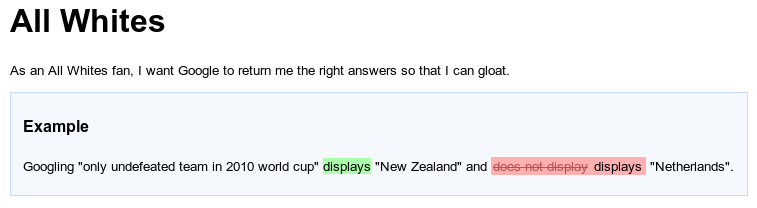
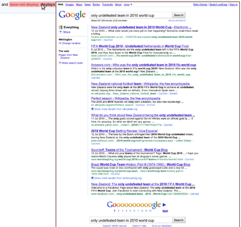

[](https://travis-ci.org/concordion/concordion-screenshot-extension)

This [Concordion](http://www.concordion.org) extension provides the capability to embed screenshots in the output specification.

The [demo project](http://github.com/concordion//concordion-screenshot-extension-demo) demonstrates this extension using Concordion with Selenium WebDriver for end-to-end browser testing.

# Introduction

This extension has two main uses - taking screenshots to help diagnose test failures, and/or explicitly adding screenshots to the output for documentation purposes.

By default, the whole screen is captured using `java.awt.Robot`. As an alternative, custom screenshots can be captured using the `ScreenshotTaker` interface. For example, when using frameworks such as Selenium, a custom screenshot taker can capture an image of the entire web page, even if the test is running in the background.

# Diagnosing test failures

When running GUI tests it can be difficult to determine what was being shown on the GUI at the time of failure [1], especially if the tests are running in the background or on a Continuous Integration server.

This extension adds screenshots to the Concordion output when failures or exceptions occur. It can also be configured to add screenshots on successful assertions.

The screenshot is displayed when you hover over the relevant element. Clicking on the element will open the image in the current browser window. For example, hovering over the failure in this web test:



shows a screenshot of the browser page at the time the failure
occurred:



Clicking on the failure opens the image for further inspection:


(Note: this image has been truncated to save space)

[1]: The screenshot is invoked by an assertion listener, so will occur a very short period after the failure actually occurred. In most cases, this small delay is of no consequence.

# Explicitly adding screenshots to the output

This extension also provides a Concordion `screenshot` command that explicitly add screenshots to the output HTML for documentation purposes.

To use the command, add an attribute named `screenshot` using the namespace `"urn:concordion-extensions:2010"` to an element in your Concordion HTML. For example:

```html
<html xmlns:concordion="http://www.concordion.org/2007/concordion"
      xmlns:ext="urn:concordion-extensions:2010">

....
<div ext:screenshot=""/>
...
```

By default, the screenshot is embedded in the output HTML. If
you'd rather have it linked, set the attribute value to
'linked', for example:

```html
<p>See <span ext:screenshot="linked" style="text-decoration: underline;">this screen</span></p>
```

**NOTE:** If you want to use the extension only as a
command, and not to capture screenshots of test failures, you will need
to use a custom configuration that sets `setScreenshotOnAssertionFailure`
and `setScreenshotOnThrowable` to `false`. See below for
custom configuration details.

# Configuration

## Default Configuration

By default, this extension will take screenshots using `java.awt.Robot`
whenever an assertion fails, or an uncaught Throwable occurs in the test.

To install the extension with default configuration, either annotate the fixture class with:

```java
@Extensions(ScreenshotExtension.class)
```

or set the system property `concordion.extensions` to 

`org.concordion.ext.ScreenshotExtension`

## Custom Configuration

Alternatively, use the `@Extension` annotation on a ScreenshotExtension
instance field. This allows methods to be called to configure the extension.

For example, the following code configures a custom `ScreenshotTaker`,
takes screenshots on assertion success as well as failure, and limits
the maximum width of the screenshot images on mouse hover to 400 pixels.

```java
    private ScreenshotTaker camera = new SeleniumScreenshotTaker(driver);

    @Extension
    public ConcordionExtension extension =
        new ScreenshotExtension().setScreenshotTaker(camera).setScreenshotOnAssertionSuccess(true)
                                 .setMaxWidth(400);
```

# Screenshot Taker

By default, the screenshot will be of the full visible screen.
This can be overridden using a custom `ScreenshotTaker`.

For example, the `SeleniumScreenshotTaker` in the above examples ensures that only the browser window is captured, that the full browser page is captured and that it is captured regardless of whether the browser window is currently displayed. (The `SeleniumScreenshotTaker` is included in the [concordion-screenshot-extension-demo](http://github.com/concordion/concordion-screenshot-extension-demo) project.)

# Further info

* [Specification](http://concordion.github.io/concordion-screenshot-extension/spec/Screenshot.html)
* [API](http://concordion.github.io/concordion-screenshot-extension/api/index.html)
* [Demo project](http://github.com/concordion/concordion-screenshot-extension-demo)

### Acknowledgements

This extension was partly inspired by Mark Derricutt's [ScreenshotCommand](http://github.com/talios/concordion-examples/blob/master/src/test/java/com/talios/ScreenshotCommand.java), and by Adam Setch's [post](https://groups.yahoo.com/neo/groups/concordion/conversations/topics/618) to the Concordion list.